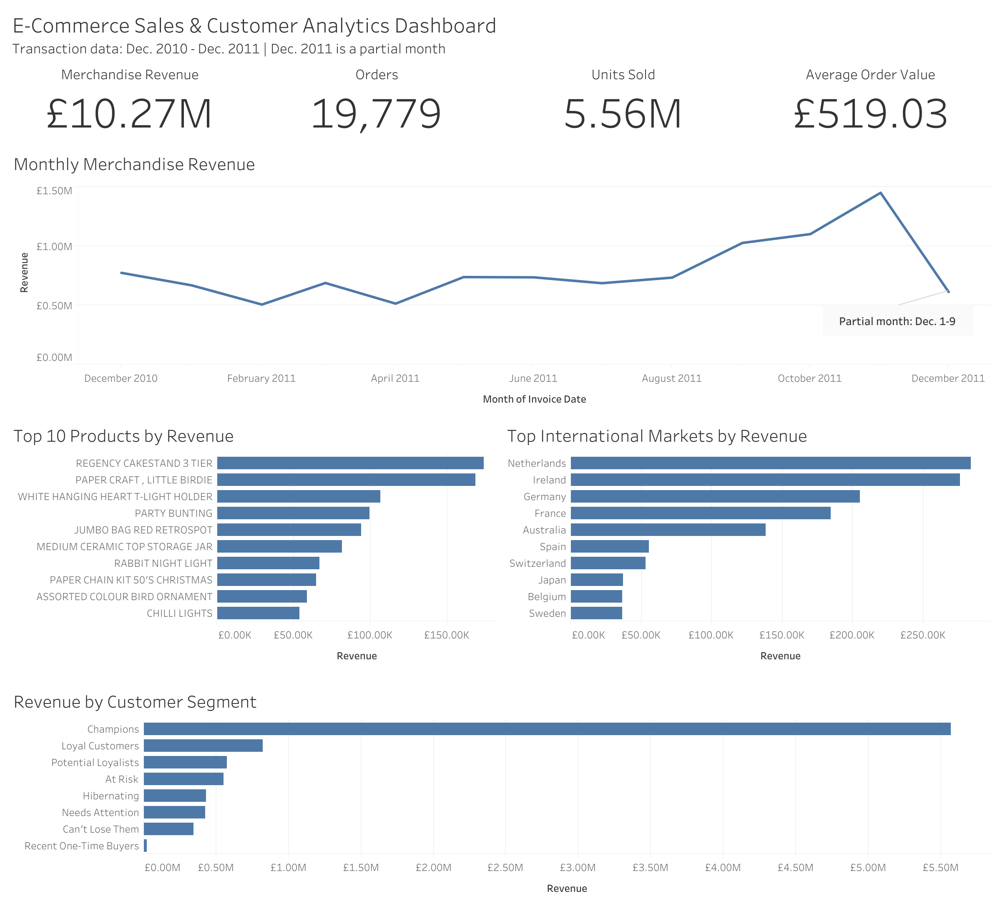

# E-Commerce Sales & Customer Analytics

## Project Overview

This project analyzes more than 500,000 transaction records from a UK-based online retailer to evaluate sales performance, product demand, international markets, customer behavior, and customer retention.

The analysis uses Python for data cleaning and exploratory analysis, SQL for business queries, RFM analysis for customer segmentation, and Tableau for dashboard development.

## Dashboard

## Interactive Dashboard

[View the interactive Tableau dashboard](https://public.tableau.com/views/E-CommerceSalesCustomerAnalytics_17889951493470/Dashboard1?:language=en-US&:sid=&:redirect=auth&:display_count=n&:origin=viz_share_link)

Explore sales trends, product performance, international markets, and RFM customer segments in the interactive Tableau dashboard.

### Dashboard Highlights

- £10.27M in merchandise revenue
- 19,779 orders
- 5.56M units sold
- £519.03 average order value
- Repeat customers generated 92.8% of identifiable-customer revenue
- Champion customers represented 20.7% of customers but generated 63.7% of customer-attributable revenue

## Business Questions

The project was designed to answer the following questions:

1. How does merchandise revenue change over time?
2. Which products generate the most revenue and unit sales?
3. Which international markets contribute the most revenue?
4. How important are repeat customers to overall revenue?
5. Which customers are the most valuable?
6. How can customers be segmented using recency, frequency, and monetary value?
7. What business actions could improve customer retention and revenue?

## Tools & Technologies

- Python
- Pandas
- NumPy
- Matplotlib
- SQL
- SQLite
- Tableau Public
- Visual Studio Code
- GitHub

## Dataset

The project uses the UCI Machine Learning Repository Online Retail dataset, containing transaction-level data from December 2010 through December 2011.

The original dataset contains 541,909 records and includes invoice numbers, product codes, descriptions, quantities, transaction dates, unit prices, customer IDs, and countries.

Dataset source: [UCI Online Retail Dataset](https://archive.ics.uci.edu/dataset/352/online+retail)

## Data Cleaning

The raw dataset required several preprocessing steps before analysis.

Key cleaning decisions included:

- Removed 5,268 exact duplicate records.
- Converted transaction dates to datetime format.
- Converted customer IDs to a nullable integer data type.
- Separated cancellation invoices from valid sales.
- Excluded negative and zero-price transactions from merchandise revenue analysis.
- Identified and excluded postage, manual entries, banking charges, and other non-merchandise transactions.
- Retained transactions without customer IDs for aggregate sales analysis while excluding them from customer-level analysis.
- Standardized product descriptions using StockCode as the primary product identifier.

After cleaning and filtering, the merchandise dataset contained **522,701 transaction-line records**.

## Key Findings

### Sales Performance

- Merchandise revenue totaled approximately **£10.27 million** across **19,779 orders**.
- Approximately **5.56 million units** were sold.
- Average order value was approximately **£519.03**.
- Revenue increased sharply during September through November 2011, with November producing the highest full-month revenue.
- December 2011 contains only December 1–9 and was treated as a partial month.

## Business Recommendations

- Prioritize retention efforts for repeat customers, who generated 92.8% of identifiable-customer revenue.
- Develop targeted win-back campaigns for high-value customers in the At Risk and Can't Lose Them segments.
- Encourage second purchases among recent one-time buyers and potential loyalists.
- Protect Champion customers through loyalty initiatives and personalized engagement.
- Explore growth opportunities in international markets such as the Netherlands and Australia, where average order values were substantially higher than in many other markets.
- Plan inventory and marketing resources around the strong seasonal sales increase observed from September through November.

## Technical Workflow

1. Imported and audited more than 500,000 transaction records using Python and Pandas.
2. Identified duplicate records, missing customer IDs, cancellations, pricing anomalies, and non-merchandise transactions.
3. Created a cleaned merchandise dataset and engineered revenue and time-based variables.
4. Analyzed sales trends, product performance, geographic markets, and customer purchasing behavior.
5. Created RFM customer segments using recency, frequency, and monetary value.
6. Loaded the cleaned data into SQLite and reproduced key business analyses using SQL.
7. Developed an interactive Tableau dashboard to communicate the major findings.

## Repository Structure

- `python/` – Python data cleaning, exploratory analysis, and RFM segmentation
- `sql/` – SQL business analysis queries
- `data/` – Aggregated analysis outputs used in the project
- `images/` – Dashboard and supporting visualizations
- `requirements.txt` – Python dependencies

### Product Performance

- **Regency Cakestand 3 Tier** generated the highest merchandise revenue at approximately **£174K** across nearly 2,000 orders.
- Several high-volume products generated much lower revenue per unit, demonstrating the difference between unit demand and revenue contribution.
- One extreme transaction for **Paper Craft, Little Birdie** included more than 80,000 units in a single order and was retained as an observed outlier rather than automatically removed.

### Geographic Performance

- The United Kingdom generated approximately **85% of merchandise revenue**.
- The Netherlands and Australia showed unusually high average order values despite relatively low order counts.
- Germany and France showed broader customer participation with lower average order values.

### Customer Behavior

- **65.3%** of customers were repeat customers.
- Repeat customers generated **92.8%** of identifiable-customer revenue.
- Repeat customers generated approximately **6.9 times more revenue per customer** than one-time customers.
- The top 100 customers generated approximately **40.7%** of identifiable-customer revenue.

### RFM Segmentation

RFM analysis was used to classify customers based on:

- **Recency** – how recently the customer purchased
- **Frequency** – how many orders the customer placed
- **Monetary Value** – how much revenue the customer generated

The resulting customer segments included Champions, Loyal Customers, Potential Loyalists, At Risk, Hibernating, Can't Lose Them, Recent One-Time Buyers, and Needs Attention.

The **Champions** segment represented approximately **20.7% of customers but generated 63.7% of customer-attributable revenue**.
